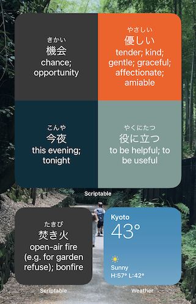
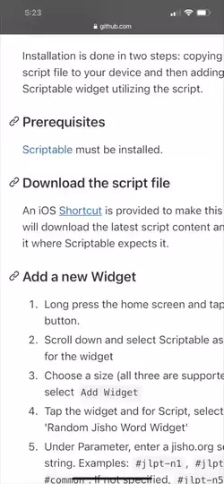
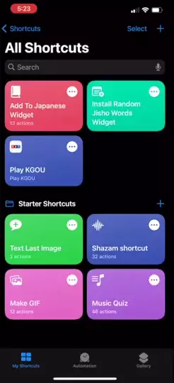

# Random Jisho Word Widget
iOS 14 widget to display random words from a jisho.org search (e.g. a selected JLPT grade).  Powered by jisho.org and Scriptable



## What is it?
iOS 14 supports adding more flexible widgets to your home screen.  The app Scriptable opens up widget development to all of us, not needing to publish an app to the App Store just to build a widget.  This widget is meant to assist Japanese learners by providing an easy way to display Japanese words with their readings and definitions in either a small, medium, or large format for review.  Which words are shown can be customized by specifying a search parameter (see details below).

## Installation
Installation is done in two steps:  copying the script file to your device and then adding a Scriptable widget utilizing the script.

### Prerequisites
[Scriptable](https://apps.apple.com/us/app/scriptable/id1405459188) must be installed.

### Download the script file
An iOS >[Shortcut](https://www.icloud.com/shortcuts/2140d9eaf4cb4b2b80b759e769b6a26a)< is provided to make this easier.  It will download the latest script content and place it where Scriptable expects it.  **Note**:  If you do not want to enable untrusted Shortcuts (necessary for running any shared ones) you can also do this step by manually copying the contents of [RandomJishoWords.js](https://github.com/okuRaku/random-jisho-word-widget/releases/download/current/RandomJishoWords.js) into a new script in Scriptable.

   

### Add a new Widget
1.  Long press the home screen and tap the ```+``` button.
2.  Scroll down and select Scriptable as the app for the widget
3.  Choose a size (all three are supported) and select ```Add Widget```
4.  Tap the widget and for Script, select 'Random Jisho Word Widget'
5.  Under Parameter, enter a jisho.org search string.  Examples: ```#jlpt-n1```, ```#jlpt-n3 #common```.  If not specified, ```#jlpt-n5``` will be used.

    

## Usage
Feel free to adjust the search at any time by modifying the widget and entering a new Parameter.  If you'd like to resize the widget, it needs to be removed and re-added.  Colors used can be easily changed by modifying the script content inside Scriptable.

## Acknowledgments
Many thanks to [MaximiliumM](https://github.com/MaximiliumM) for publishing [this widget](https://github.com/MaximiliumM/JapaneseWidget) which performs a very similar function.  I wanted an app to display a wider variety of words with more open-ended configuration and was able to use their code as a starting point.  I also would like to express gratitude to all of the contributors to jisho.org, including its authors and everyone who curates the data it links us to.  It is a wonderful tool.
